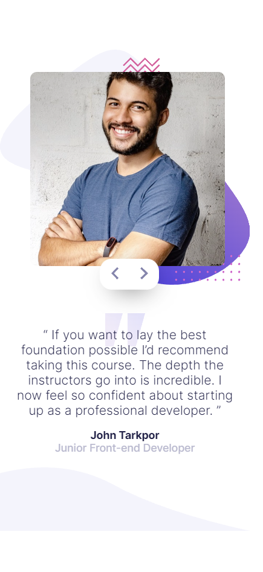
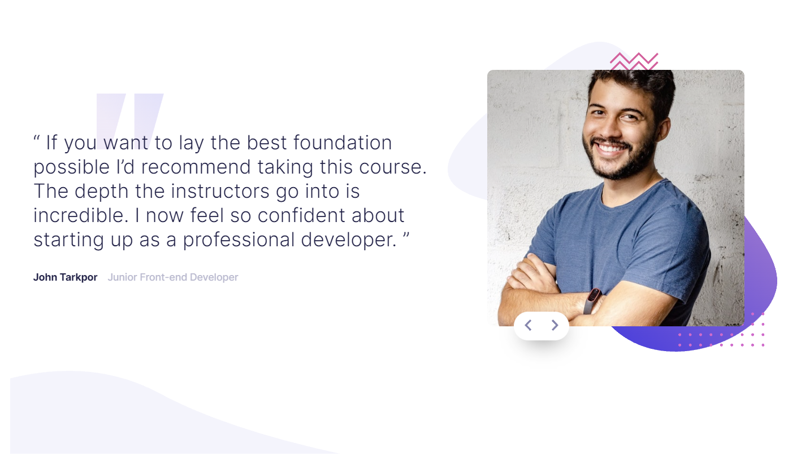

# Frontend Mentor - Coding bootcamp testimonials slider solution

This is a solution to the [Coding bootcamp testimonials slider challenge on Frontend Mentor](https://www.frontendmentor.io/challenges/coding-bootcamp-testimonials-slider-4FNyLA8JL). Frontend Mentor challenges help you improve your coding skills by building realistic projects. 

## Table of contents

- [Overview](#overview)
  - [The challenge](#the-challenge)
  - [Screenshot](#screenshot)
  - [Links](#links)
- [My process](#my-process)
  - [Built with](#built-with)
  - [What I learned](#what-i-learned)
  - [Continued development](#continued-development)
- [Author](#author)

## Overview

### The challenge

Users should be able to:

- View the optimal layout for the component depending on their device's screen size
- Navigate the slider using either their mouse/trackpad or keyboard

### Screenshot

### Links

- Solution URL: [Add solution URL here](https://github.com/ioangheraszim/coding-bootcamp-testimonials-fe)
- Live Site URL: [Add live site URL here](https://ioangheraszim.github.io/coding-bootcamp-testimonials-fe/)

## My process

### Built with

- Semantic HTML5 markup
- CSS custom properties
- Flexbox
- Mobile-first workflow
- Javscript

### What I learned

This project taught me the power of CSS animations and JavaScript rendering. I explored CSS animations, mastering keyframe animations and property transitions. With JavaScript, I dynamically updated text, images, and applied animations. This knowledge will enhance future projects, enabling captivating user interfaces and seamless experiences.

### Continued development

In future projects, I will prioritize refining my skills in three key areas: API integration, React framework, and JavaScript proficiency. By focusing on these areas, I aim to build dynamic applications, leverage the power of React for efficient UI development, and enhance my JavaScript expertise.

## Author

- Frontend Mentor - [@ioangheraszim](https://www.frontendmentor.io/profile/ioangheraszim)
